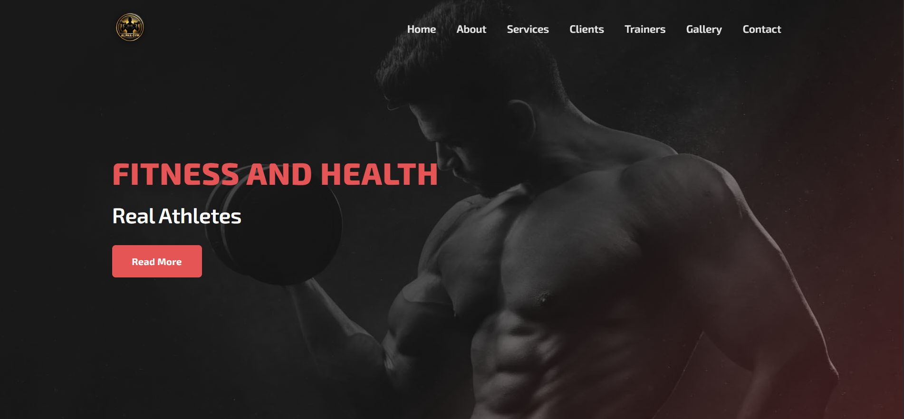
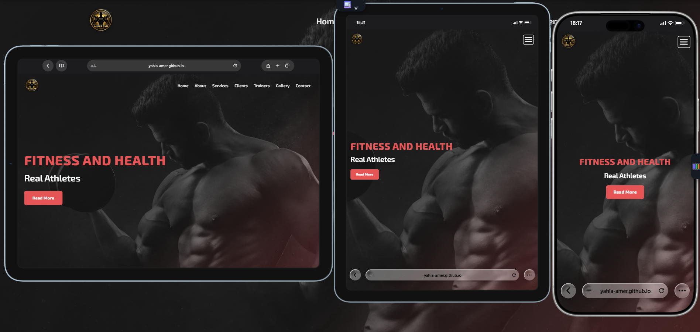

# Alpha Gym

A responsive gym website built as a front-end project using HTML5 and CSS3.

The project focuses on creating a clean fitness website with a structured layout, responsive design, and different sections for services, trainers, clients, and contact information.

## Features

* Responsive navigation
* Hero section
* About Us section
* Services section
* Clients section
* Trainers section
* Image gallery
* Contact section
* Responsive layout for different screen sizes
* Custom CSS styling and animations

## Technologies

* HTML5
* CSS3
* Custom Responsive CSS
* Google Fonts

## Preview

### Desktop



### Mobile 



## Project Structure

## Live Demo
https://yahia-amer.github.io/ALPHA-GYM/


```text
Alpha-Gym/
│
├── index.html
│
├── css/
│   ├── all.css
│   ├── fonts.css
│   ├── global.css
│   ├── gym.css
│   ├── keyframe.css
│   └── responsive.css
│
└── photo/
    ├── Logo.png
    ├── gym.1.png
    ├── wallpaper.jpg
    ├── person.1.jpg
    ├── person.2.jpg
    ├── person.3.jpg
    ├── person.4.jpg
    ├── c1.jpg
    ├── c2.jpg
    └── g1.jpg - g7.jpg
```

## Responsive Design

The website uses custom CSS media queries to adapt the layout to different screen sizes.

The navigation, content sections, trainers, gallery, and contact form are adjusted for tablet and mobile screens.

## Sections

The website includes:

* Home
* About
* Services
* Clients
* Trainers
* Gallery
* Contact

## Notes

This project is a front-end website and does not include backend functionality.

## Author

Yahia Amer

Front-End Developer
